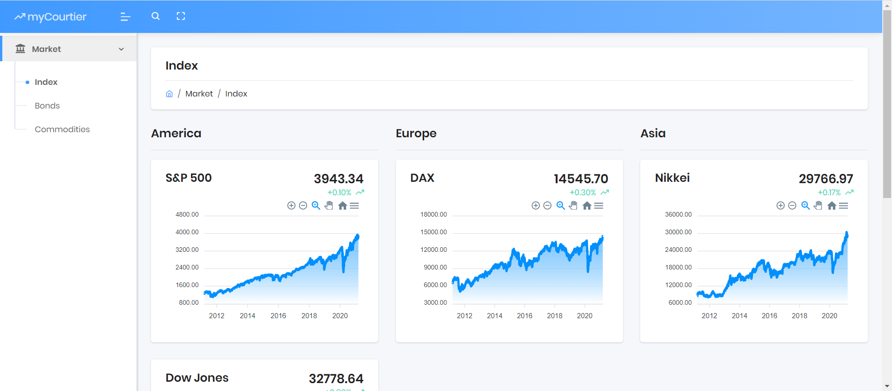
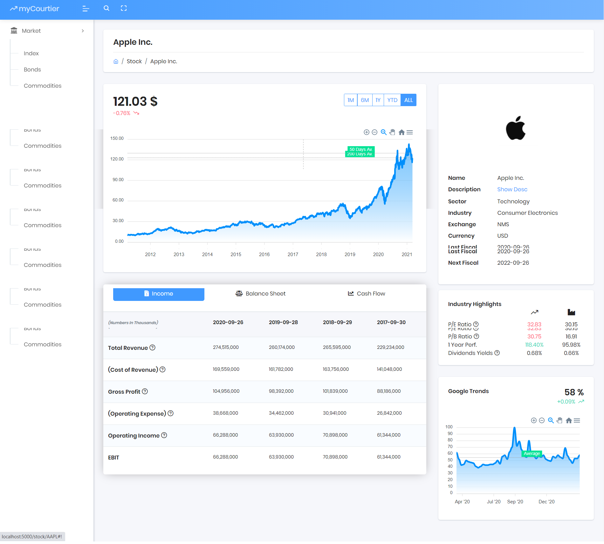

# My Courtier - Portfolio Tracker

This is a portfolio tracking website written in Python and in active dev.
Try it:
>   

## Market

Show index, commodities, bonds for a whole market picture.

## Stock

You can search for stock and display a lot of informations on them:

